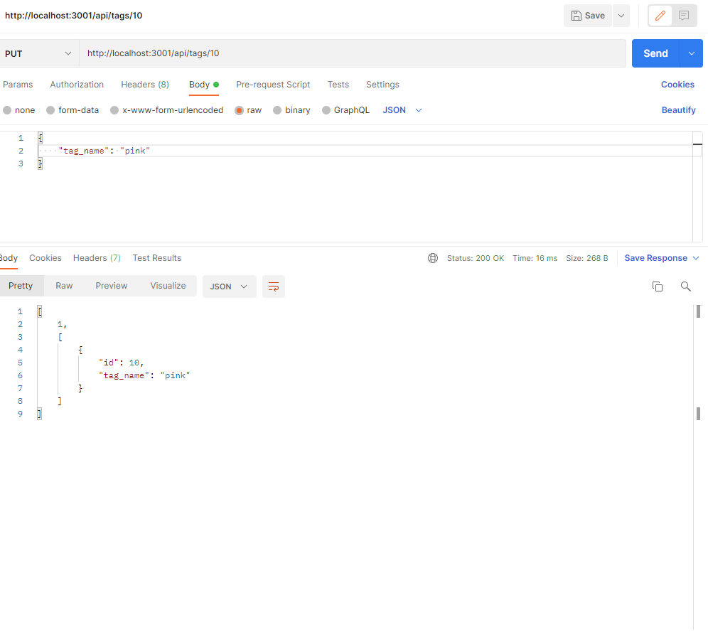

# 13 Object Relational Mapping (ORM): E-commerce Back End

Your challenge is to build the back end for an e-commerce site. You’ll take a working Express.js API and configure it to use Sequelize to interact with a MySQL database.

## Steps

* created repository and cloned
* looked over exisiting code
* installed npm files mysql2, express, sequelize and dotenv
* created the .env file to hide user, password and db name from connections
* updated server.js file to connect to sequelize
* filled in all the models
* updated each route accordingly to find, create, update and destroy
* tested each option to make sure routes worked accordingly

## Screenshots

## Links

GitHub: https://github.com/ToiletTakos/e-commerce-back-end

Had to be 2 video links due to the length of Screencastify free video recording
Video link:(2) 1) https://watch.screencastify.com/v/CzRlZQ1M1O2x1KEz89hY
               2) https://watch.screencastify.com/v/a7pYw69tbztXuQvaAPHT